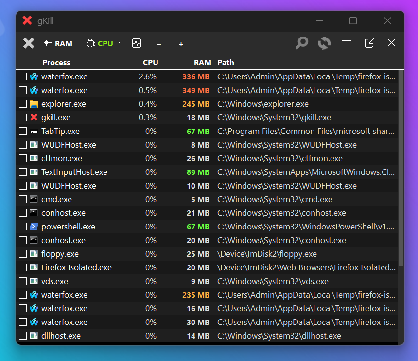
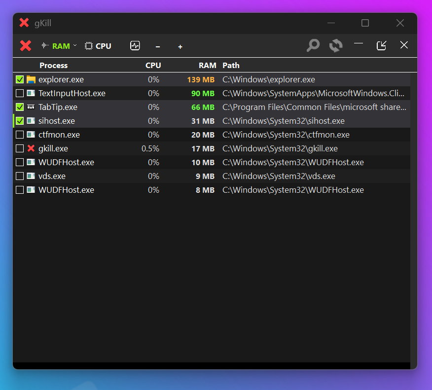
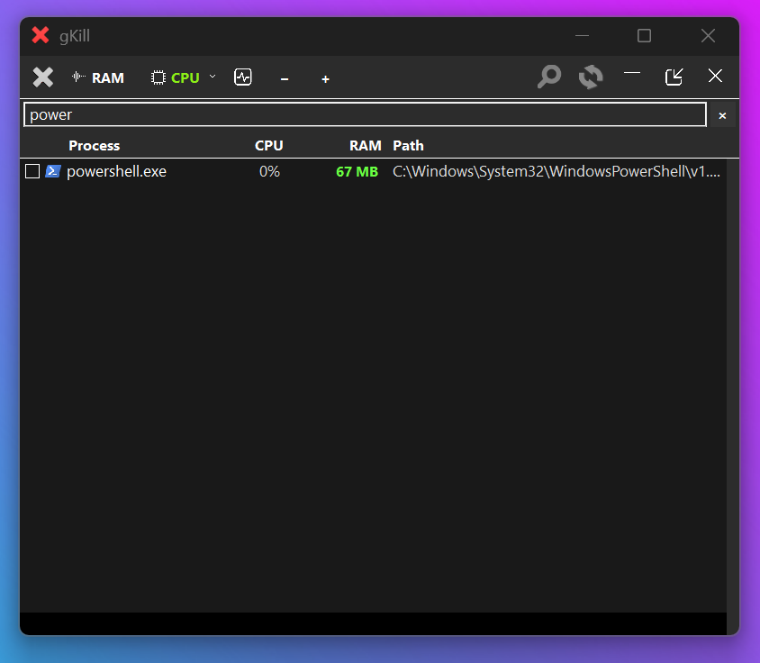
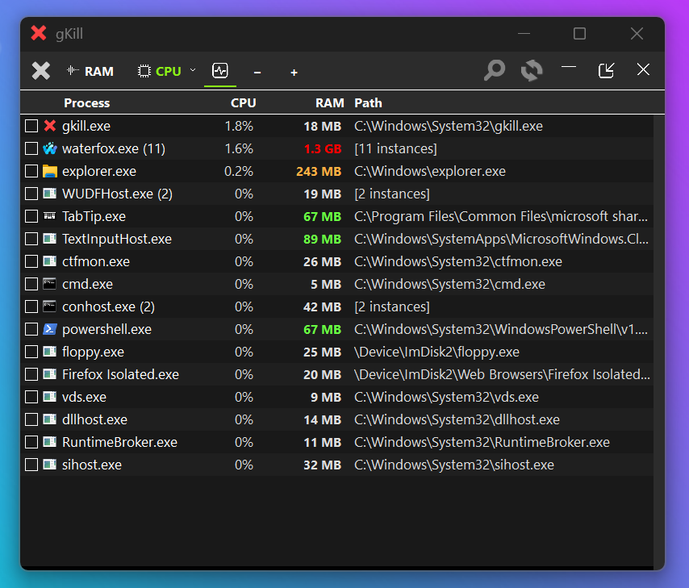
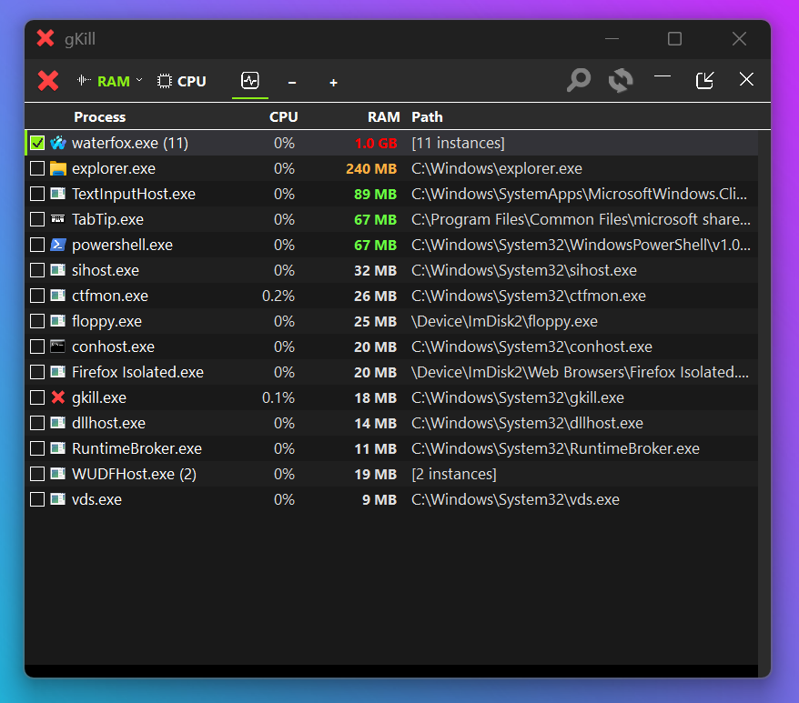
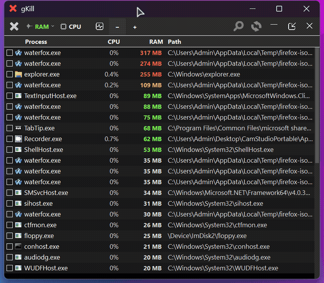
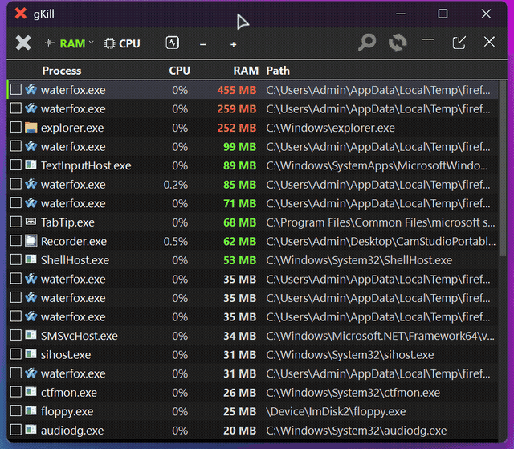
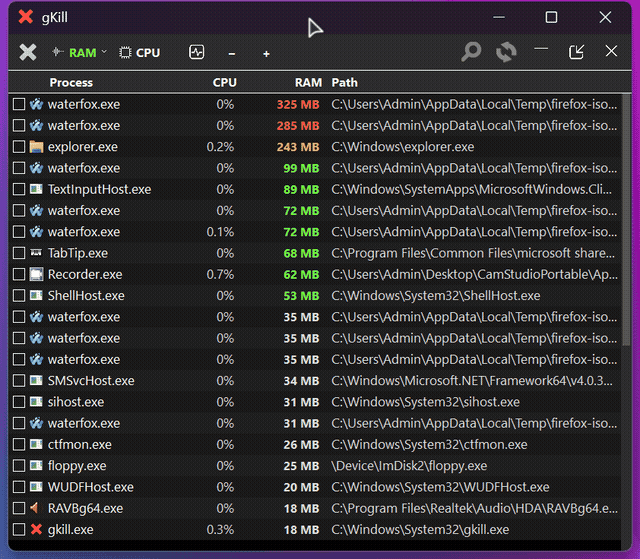
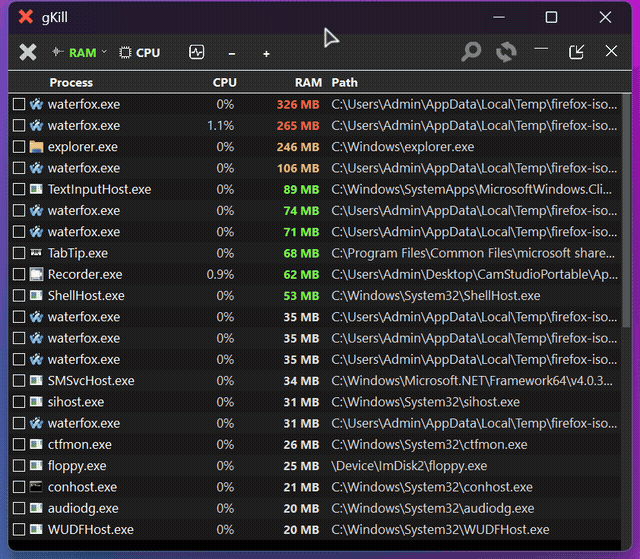
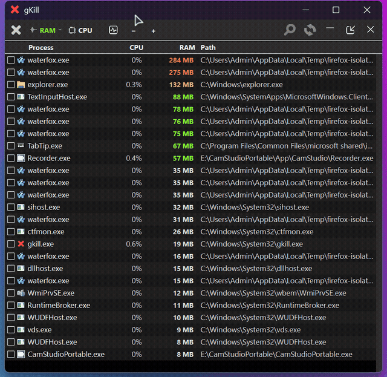

# gKill - Aggressive Task Killer

A portable, zero-dependency task killer for Windows and WinPE. Built in pure Win32 C, statically linked, runs from anywhere - USB stick, WinPE recovery, or a full Windows 11 install.

When Task Manager fails because the system is under heavy load, gKill still works. It uses a 5-method kill chain that escalates until the target process is dead.



## Download

**[gkill.exe](https://github.com/GlitchLinux/gKill/releases/download/v1.0/gkill.exe)** (539 KB, standalone, no installer needed)

## Features

### Process List with Real-Time Monitoring
- Sorted by RAM or CPU usage
- Color-coded RAM values (green/orange/red by usage tier)
- Process icons extracted from executables
- Full exe path display

### Select and Kill

Check individual processes and kill them with one click. Shift-click for bulk range selection.



### Search and Filter

Ctrl+F opens the search bar to find any process by name - including background services not shown in the default view.



### Grouped View

Toggle grouped view (Ctrl+G) to collapse multiple instances of the same app into one row. Shows combined RAM and instance count. Checking a group kills all instances at once.





### Demo: Sort, Search, and Kill



### Demo: Bulk Select and Kill



### Demo: Individual Target Selection



### Demo: Group Kill



### Demo: CLI Kill


### Demo: Nuclear Option



## Kill Chain (5 methods, escalating)

1. **TerminateProcess** - standard Win32 API
2. **NtTerminateProcess** - ntdll direct call, bypasses some hooks
3. **NtSuspendProcess + TerminateProcess** - freezes all threads first to prevent respawn
4. **Process tree kill** - recursively kills all child processes
5. **taskkill /F /T** - shell fallback as last resort

## Keyboard Shortcuts

| Key | Action |
|-----|--------|
| Ctrl+K | Kill all checked processes |
| Ctrl+F | Open search/filter |
| Ctrl+S | Pause/resume auto-refresh (freeze list for easier targeting) |
| Ctrl+G | Toggle grouped view |
| Ctrl+R | Force refresh (also unpauses) |
| Ctrl+Plus/Minus | Zoom in/out |
| Ctrl+0 | Reset zoom |
| Arrow keys | Navigate process list |
| Space | Toggle checkbox on focused row |
| Shift+Click/Space | Range select (bulk check) |
| Delete | Kill checked processes |
| Escape | Close search bar |
| Page Up/Down | Jump through list |
| Home/End | Jump to top/bottom |

## Command Line Usage

```
gkill.exe                         # Launch GUI
gkill.exe --systray               # Start minimized to system tray
gkill.exe waterfox.exe             # Kill all waterfox processes (no GUI)
gkill.exe C:\path\to\app.exe      # Kill by full path
gkill.exe app1.exe app2.exe        # Kill multiple targets
gkill.exe gkill.exe                # Kill zombie gKill instance (safe - excludes own PID)
```

## Smart Behaviors

- **Self-kill recovery**: If you kill gKill itself, a scheduled task revives it to the system tray within 60 seconds
- **Explorer auto-restart**: Killing explorer.exe automatically relaunches it after 5 seconds so you don't get stuck on a black screen
- **Clean exit**: Right-click tray icon and "Exit" removes the reviver task - gKill stays dead
- **Dark title bar**: Forces dark mode title bar on Windows 11 regardless of system theme
- **DPI-aware**: Renders at native resolution with manual zoom controls

## Building from Source

Cross-compile from Linux using MinGW:

```bash
cd src/
x86_64-w64-mingw32-windres resources.rc -o resources.o
x86_64-w64-mingw32-gcc -O2 -o gkill.exe gkill.c resources.o \
    -lgdi32 -lcomctl32 -lpsapi -lshell32 -luxtheme -mwindows -municode -static
x86_64-w64-mingw32-strip gkill.exe
```

Icons must be in an `icons/` directory relative to `resources.rc`.

## Requirements

- **Runtime**: None. Statically linked, depends only on kernel32, user32, gdi32, advapi32, shell32, comctl32 - all always loaded in memory.
- **Build**: MinGW-w64 cross-compiler (`x86_64-w64-mingw32-gcc`)
- **Tested on**: Windows 11 23H2/25H2, Windows 10, WinPE

## Context Menu Integration

To add "gKill this process" to the right-click menu for .exe files:

1. Copy `gkill.exe` to `C:\Windows\System32\`
2. Import `gkill-context-menu.reg`
3. To remove: import `gkill-context-menu-remove.reg`

## License

MIT

## Credits

Built by [GlitchLinux](https://glitchlinux.com)
